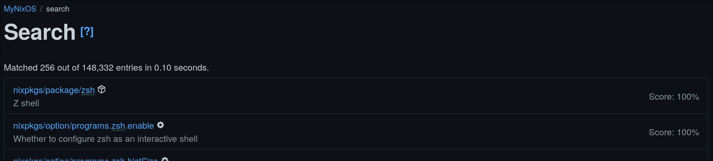
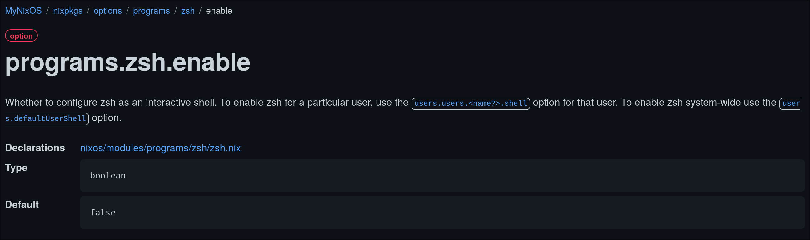

# NixOS and Home Manager

If declaratively defining your complete operating system and user environment sounds like a joy to you, then Nix is the tool for the job. There is a bit of a learning curve but in this blog post I'll cut through the weeds and outline how you can learn about Nix and it's ecosystem as quickly as possible. Lets go for a ride, a learning how to learn, after which you'll be able to take the wheel and ride off into the sunset that is Nix by yourself.

## What's this Nix you speak of?

If you are reading this then chances are you are somewhat familiar but struggling to find your way around the ecosystem. On the off chance that you stumbled upon this blog some other way, I'll briefly go over the basics:

In summary, Nix is a deployment system dreamed up by Eelco Dolstra et al. back in 2004 to deal with some of the issues that arise when distributing and building software across different machines and operating environments.

It's a tool and functional programming language used to package up software into what Nix calls `derivations`. A derivation is a higher order package that bundles everything that's required to purely build a piece of software. If you want to learn more about the issues Nix set out to solve and how it works at this particular layer of the cake, I highly recommend that you read through [the abstract of their master thesis](https://edolstra.github.io/pubs/nspfssd-lisa2004-final.pdf).

What often confuses newcomers is that there is also a Nix based Linux distribution aptly named NixOS. Nix builds, packages, and distributes software which is essentially everything needed for and handled by your average bare metal Linux distribution. That someone would eventually come along and package those derivations and modules up into a handy Linux installer was only a matter of time.

## Looking for a quick fix?

The way Nix works is a bit of a paradigm shift and that's one of the reasons people have a hard time getting into it. Another is the somewhat abysmal state of its documentation. While attempts are on the way to improve upon that, information on how Nix works is still scattered across different websites and Wikipedia pages. For those of you with shorter attention spans, these are the resources I'll recommend you go through in this article. Don't bother with other websites:

1. <https://nix.dev> - Take your first steps here. Don't get lost on Nix Pills or some other obscure website.
1. <https://nix.dev/manual/nix> - For when you want to dig deeper.
1. <https://nixos.org/manual/nixos/stable> - For those who want to run NixOS.
1. <https://nix-community.github.io/home-manager> - For managing your user environment separately.
1. <https://mynixos.com> - For finding existing packages and their configuration options.
1. <https://github.com/NixOS/nixpkgs> - The Nix package repository where the work on all derivations takes place.
1. <https://wiki.nixos.org/wiki/NixOS_Wiki> - The official wiki

Check these sources first, then consider alternatives such as the community maintained Wikipedia (which is in the process of being phased out).

## A four-step plan to learning Nix

### Learn to read the syntax

It's a lot and you'll want to take a methodical approach to learning. If you are just starting out avoid diving deep into Nix shells or the way packaging and building derivations work. It's valuable knowledge but at this stage it's more important that you are able to read the language itself. Start by going over the [language basics](https://nix.dev/tutorials/nix-language) so you have an idea of what it's you are looking at when writing your first `configuration.nix` or `flake.nix`.

### Go over the configuration syntax and module system

Many of the examples or repositories you will be referencing and drawing inspiration from can be a bit intimidating and will often contain custom code, use nix flakes or depend on other libraries to extend it's functionalities. If you don't understand how Nix ties all of this together you'll quickly get lost. Spend some time learning about the [configuration syntax](https://nixos.org/manual/nixos/stable/#sec-configuration-syntax) and [the Nix module system](https://nix.dev/tutorials/module-system).

In summary, assuming you understand what an attribute set is, Nix modules consist of functions taking a single attribute set as a parameter and returning an attribute set adhering to a specific schema:

```nix
{ ... }:

{
  services.httpd = {
    enable = true;
    adminAddr = "alice@example.org";
    virtualHosts.localhost.documentRoot = "/webroot";
  };
}
```

### Use Nix to configure a well-known application

Since Nix has the largest package repository in the world, chances are your favorite piece of software is already packaged up into a derivation and actively being maintained. See if you can find it by searching for it on [MyNixOS](https://mynixos.com). As an example, lets take a look at the Unix shell, Zsh:



In the screenshot above you can see that Zsh exists as a derivation (`nixpkgs/package/zsh`) as well as a Nix Module (`nixpkgs/option/programs.zsh`). Oftentimes a Nix module already exists to simplify configuring the application and abstracting away any complexities that may be involved with it. To use the Zsh module lets enable it as follows:

```nix
{ ... }: 

{
  programs.zsh = {
    enable = true;
    # And enable the ohMyZsh option while we are at it..
    ohMyZsh = {
      enable = true;
      plugins = [
        "git"
      ];
    };
  };
}
```

Clicking through MyNixOS provides additional information about the `enable` module option. Such as its type and its default value but also a link to the module in the nixpkgs package repository:



Once you feel you are somewhat comfortable with the Nix language and you understand how the module system works, you should definitely take a look at some of these module files in the `nixpkgs` repository. You'll likely find them surprisingly straightforward to understand. Especially when you have configured a couple of applications and built a module yourself.

### Learn how to package an application

Go ahead and read through the [First Steps](https://nix.dev/tutorials/first-steps/) learning about nix shells and [packaging existing software with Nix](https://nix.dev/tutorials/packaging-existing-software). Once you have worked through those guides you should find that almost all the puzzle pieces have naturally fallen into place.

## Home Manager

Home Manager is a tool created by the Nix community to specifically manage your user's home directory, separately from your OS. It provides an additional set of Nix modules specifically dedicated to managing your user programs, configuration files, environment variables, etc. At its core, it's just Nix, built on top of Nix and the module system you have since become familiar with. It's just wired up a little differently. For more information, [check out the official documentation](https://nix-community.github.io/home-manager).

## Still here? Impressive

That's it. You should now be able to take your bike off that kickstand and go for a ride all on your own. If you are craving some more inspiration, you are welcome to take a look at my humble [NixOS](https://github.com/99linesofcode/nixos-config) and [Home Manager](https://github.com/99linesofcode/home-manager) repositories. They're heavily inspired by the work of others and still a work in progress but perhaps you can find some use for them.

Happy tinkering!
